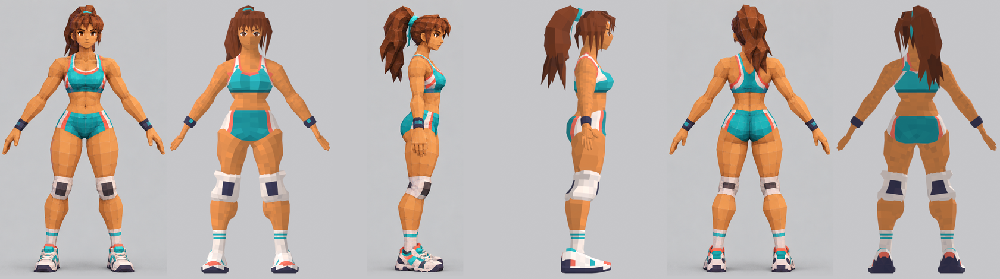

# Atleta low poly (Unity)

Personaje 3D low poly facetado construido **solo con scripts de Python (bpy)** a partir de la hoja
`reference/atleta_turnaround.png` (vistas FRONT / SIDE / BACK).



## Entregables

| Archivo | Contenido |
|---|---|
| `export/atleta.blend` | Escena completa: malla `Atleta`, `Armature`, 5 acciones (también como pistas NLA) |
| `export/atleta.fbx` | Para Unity: Y arriba, escala 1, sin leaf bones, textura embebida, 5 tomas |
| `export/atleta.glb` | glTF binario con skin, colores de vértice y las 5 animaciones |
| `export/atleta_atlas.png` | Atlas 32×64 px (16 colores × 8 tonos) — ya embebido en FBX/GLB/blend |
| `renders/compare_final.png`, `renders/sidebyside_final.png` | Referencia vs modelo (front/side/back) |
| `renders/anim_*.png` | Hojas de fotogramas de cada animación |
| `renders/deform_poses.png` | Poses extremas (hombros, codos, caderas, rodillas) |
| `PROGRESS.md` | Registro de las iteraciones y problemas resueltos |

## Datos del modelo

- **Triángulos: 9 329** (cuerpo 6 318 · pelo ~1 650 · zapatillas 2×390 · rodilleras 2×180 · muñequeras 2×80 · goma/cintas 96 · rasgos faciales ~100).
- Altura 1.764 m (≈7.5 cabezas), A-pose con brazos a ~35-40°.
- Una sola malla y **un solo material** (1 draw call): atlas de colores planos con UVs al centro de cada celda + colores de vértice (`Col`) con variación de tono por cara. Sombreado plano (flat).
- Cuerpo base: una malla generada con Skin modifier + Subdivision, esculpida proyectando sobre un campo SDF anatómico (≈30 músculos). Anillos de aristas en hombros, codos, caderas, rodillas y tobillos.

## Armadura (compatible con Unity Humanoid)

`Hips › Spine › Chest › UpperChest › Neck › Head`, `Left/RightShoulder › UpperArm › LowerArm › Hand`,
dedos `Thumb/Index/Middle/Ring/Little` × `Proximal/Intermediate/Distal`,
`Left/RightUpperLeg › LowerLeg › Foot › Toes`, y `Ponytail1..5` (hijos de `Head`). 57 huesos.

## Animaciones

| Acción | Fotogramas (30 fps) | Bucle | Notas |
|---|---|---|---|
| `APose` | 1-2 | — | Pose de reposo |
| `Idle` | 1-61 | sí | Respiración (pecho/hombros), balanceo leve, coleta |
| `Walk` | 1-33 | sí | En el sitio, balanceo de brazos, rotación de cadera, coleta con retraso |
| `Run` | 1-21 | sí | Inclinación, codos a ~75°, rodillas altas, coleta con retraso |
| `Jump` | 1-44 | no | Agachado → impulso → vuelo (cadera +0.34 m) → aterrizaje; la coleta reacciona a la velocidad vertical |

## Importar en Unity

1. Copia `export/atleta.fbx` a `Assets/`.
2. **Model**: Scale Factor 1, *Convert Units* activado; si el modelo aparece girado, marca *Bake Axis Conversion*.
3. **Rig**: Animation Type = **Humanoid**, Avatar Definition = *Create From This Model* → *Configure…*: el mapeo es automático
   (nombres estándar). Unity puede pedir *Enforce T-Pose* porque el modelo está en A-pose; acéptalo.
   Los huesos `Ponytail*` quedan como huesos extra (se animan desde los clips).
4. **Animation**: aparecen las tomas `Armature|APose`, `Idle`, `Walk`, `Run`, `Jump`. Marca *Loop Time* en Idle/Walk/Run.
   Para que la coleta conserve su animación con Humanoid, añade los `Ponytail*` en *Mask › Transform*.
5. **Materials**: *Extract Textures/Materials*; pon el filtro de la textura en **Point** y sin compresión para colores planos.
   (Alternativa: un shader que use el color de vértice `Col`.)
6. Con glTF (`export/atleta.glb`) usa un importador como glTFast o UniGLTF.

## Reconstruir desde cero

Requisitos: Blender 4.x (probado con 4.0.2 de apt), `xvfb-run`, numpy para el Python de Blender,
y Pillow + scipy para los scripts de comparación.

```bash
./build_all.sh
```

| Script | Función |
|---|---|
| `scripts/crop_reference.py` | Recorta la hoja en `reference/ref_*.png` y genera las siluetas `sil_*.png` |
| `scripts/anatomy.py` / `sdf.py` | Articulaciones, perfiles medidos y campo SDF de músculos |
| `scripts/build_body.py` | Cuerpo base (Skin → Subsurf → disparo por normal sobre el SDF → desenredado) |
| `scripts/build_model.py` | Ropa por cortes implícitos, rodilleras, muñequeras, zapatillas, pelo, cara, atlas |
| `scripts/render_views.py` | Render ortográfico front/side/back (Eevee, fondo gris, mismo encuadre que la referencia) |
| `scripts/compare.py` | Comparativa + IoU de silueta (`compare.py <tag> rows` imprime diferencias por altura) |
| `scripts/rig_animate.py` | Armadura, pesos (bone heat + correcciones), acciones |
| `scripts/export_unity.py` | FBX + GLB y verificación por re-importación |
| `scripts/render_anim.py` | Hojas de animación y test de deformación |
