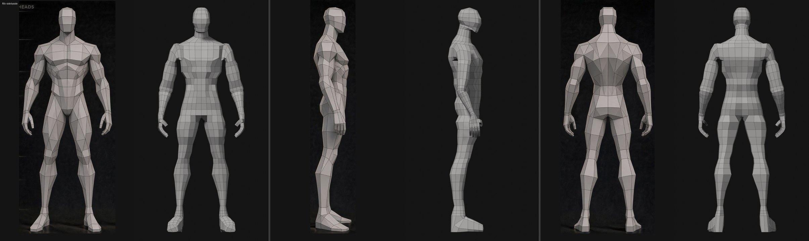
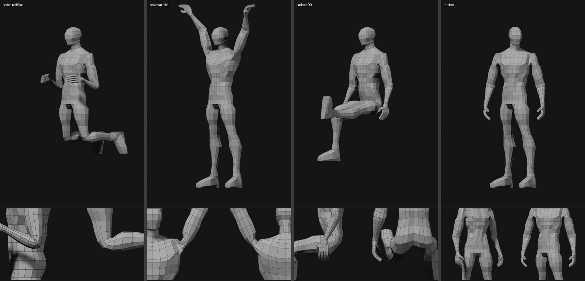

# Maniquí base masculino facetado

Base mesh low/mid poly de un hombre de complexión atlética heroica:
- 1.80 m y 8 cabezas;
- A-pose, como la hoja de referencia;
- origen entre los pies, metros.

Modelado desde cero y solo con scripts de Python (bpy), a partir de `ref/hoja_maniqui.jpg`. Las transiciones de densidad siguen la tabla de patrones `ref/tabla_poligonos.jpg`.



## Entregables (`export/`)

| archivo | contenido |
|---|---|
| `mannequin_male.blend` | Una sola malla `mannequin_male`: Mirror aplicado, sombreado plano, sin modificadores, sin cámaras ni luces. Material de arcilla gris. |
| `mannequin_male.fbx` | La misma malla, con normales por cara, Y arriba y −Z delante (lista para Unity o Unreal). |
| `mannequin_male.glb` | La misma malla en glTF binario. glTF solo guarda triángulos: los quads se triangulan al exportar y los vértices se separan para mantener las normales planas. |
| `mannequin_male_stats.json` | Validación final, lista de polos y transiciones de la tabla usadas. |

**Visor web**: `web/index.html` es autocontenido (la malla va embebida).
- three.js con `flatShading`, arcilla más aristas de los quads (sin las diagonales de los triángulos).
- Cámaras frente, perfil y espalda (ortográficas, como la hoja) y 3/4 (perspectiva), con órbita.
- Regla de 8 cabezas.
- Probado en escritorio (1280×800) y móvil (390×844, táctil, tema oscuro).

## Datos de la malla

| | |
|---|---|
| caras | **1 566 quads** (0 triángulos, 0 n-gons) · 3 132 triángulos al triangular |
| vértices / aristas | 1 568 / 3 132 · V − A + C = 2 (una superficie cerrada) |
| manifold | 0 aristas abiertas, 0 no manifold, 0 duplicados, 0 caras internas, 0 degeneradas |
| autointersecciones | 0 (BVH) |
| normales | todas hacia fuera |
| simetría | exacta (error 0; los vértices del eje en x = 0) |
| polos | 23 + 23 de valencia 5 y 27 + 27 de valencia 3, ninguno de más de 5 ni en zona de articulación (justificados en `PROGRESS.md`) |
| loops en articulaciones | hombro 4 · codo 4 · muñeca 3 · rodilla 3 · tobillo 3 · cuello y cintura ≥ 2 |
| siluetas contra la hoja | bordes dentro de ±1 cm: front 92 %, side 88 %, back 85 % (IoU 0.926 / 0.929 / 0.891) |

### Transiciones de densidad (tabla de Pedro Amaro Santos)

| transición | patrón |
|---|---|
| pelvis → muslo (14 → 10) | Linear Stepping con 2 FourPointTriangles (ingle y pliegue del glúteo) |
| torso → cuello (10 → 8) | Linear Stepping con 1 FourPointTriangle (clavícula) |
| nudillos → palma (16 → 12) | Linear Stepping con 2 FourPointTriangles (dorso y palma) |
| palma → muñeca (12 = 12) | Bridge con un loop intermedio |
| palma → dedos | Parallel Division (4 bases de dedo + 3 membranas) |
| puntas de los dedos | Parallel Division (anillo de 4 → 1 quad) |
| puntera del pie | Grid Division 2 × 3 |
| coronilla | Grid Division 2 × 3 |

## Test de deformación (temporal)

`scripts/deform_test.py` crea un esqueleto provisional con pesos automáticos suavizados, prueba las poses, mide y **borra el esqueleto**. El entregable no lleva rig.

| pose | autointersecciones | caras aplastadas | volumen | grosor en la articulación (reposo → pose) |
|---|---|---|---|---|
| codos y rodillas a 90° | 24 (12 por codo, en el pliegue interior) | 2 | −1.8 % | codo 7.7 → 11.0 cm · rodilla 10.3 → 11.3 cm |
| brazo arriba 180° | 0 | 0 | +1.7 % | hombro 17.2 → 10.3 cm |
| cadera a 90° | 0 | 1 | −4.9 % | muslo 19.8 → 18.8 cm |
| torsión de columna 35° | 0 | 0 | −1.0 % | 20.4 → 20.8 cm |



- Las rodillas, el brazo levantado, la cadera y la torsión deforman sin cruces. El grosor en la articulación no cae: no hay pinzamientos.
- **Codo a 90°.** Con pesos automáticos (skinning lineal), el bíceps y el antebrazo musculados se tocan en el pliegue interior.
  - Se corrige en la fase de rig pintando los pesos del codo o con una corrección de forma.
  - La topología ya tiene 4 loops en el codo para ello.
- **Hombro con el brazo arriba.** El grosor de 10.3 cm es el del plano oblicuo del hombro en la pose, no una pérdida de volumen: el volumen total sube un 1.7 %.

## Reconstrucción

```sh
cd mannequin_male
python3 scripts/crop_reference.py                                    # recorta y calibra la hoja (ref/)
RENDER_DIR=s6_final sh scripts/iter.sh f6b                           # construye, valida, renderiza y compara
RENDER_DIR=s7_deform xvfb-run -a blender -b -P scripts/deform_test.py -- d7b
xvfb-run -a blender -b -P scripts/export.py                          # export/ y web/mannequin_male.json
python3 web/build_viewer.py                                          # web/index.html
```

| script | función |
|---|---|
| `scripts/mesh.py` | Media malla de quads: anillos, bridge, Linear Stepping (quad, FourPointTriangle, trapecios) y tapas Grid / Parallel. |
| `scripts/figure.py` | La figura por bloques: torso y pelvis, piernas y pies, brazos y manos, cuello y cabeza. |
| `scripts/tables.json` | Medidas de cada anillo y tablas de talla por planos (`carve`, `leg_carve`, `arm_carve`, `head_carve`, `neck_carve`). |
| `scripts/fit.py` | Ajuste de anchos y radios contra las siluetas de la hoja. |
| `scripts/compare.py`, `scripts/zoom.py`, `scripts/grid_ref.py` | Comparación hoja / modelo con la misma cámara, recortes por zona y rejilla métrica sobre la hoja. |
| `scripts/validate.py` | Validación: manifold, duplicados, caras internas, autointersecciones, simetría y polos por zona. |

El registro completo de las 7 etapas y sus iteraciones está en `PROGRESS.md`.
