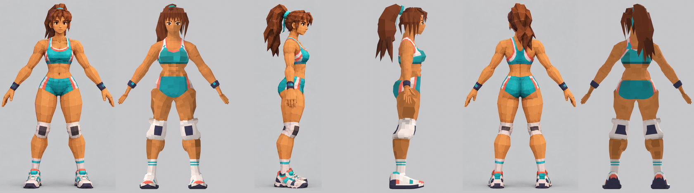

# Atleta v2 — mismo presupuesto, mejor modelado

Copia independiente del pipeline original (`../scripts`, `../export` no se tocan).
Se reconstruye con `./build_all.sh` desde esta carpeta; todo sale en `v2/export` y `v2/renders`.

| | Original | v2 |
|---|---|---|
| Triángulos | 9 329 | **9 053** |
| IoU silueta F/S/B | 0.82 / 0.83 / 0.84 | **0.84 / 0.85 / 0.85** |

## Qué cambia (sin añadir triángulos)

1. **Sombreado de pliegues («pintado»)**: el tono de cada cara ya no es aleatorio; sale de una
   oclusión ambiental calculada con el campo anatómico (axilas, bajo el pecho, entre músculos,
   entrepierna más oscuros) + una variación pequeña. Atlas con 10 tonos (0.66–1.09) en lugar de 8.
   En la cabeza la oclusión se reduce al 25 % para mantener la cara limpia.
2. **Musculatura más marcada**: uniones musculares más nítidas (k menor) y surcos restados del
   campo: línea alba, dos líneas de abdominales, separación deltoides/bíceps-tríceps, vasto
   lateral/recto femoral, cabezas del gemelo y pliegue bajo el pectoral.
3. **Reparto de triángulos**: subdivisión local del abdomen (el six-pack ahora se ve), pagada
   diezmando más los dedos (55 % → 38 %) y borrando el cuero cabelludo oculto bajo el pelo.
4. **Short**: pierna de corte más alto en los laterales y franjas laterales finas
   (blanco φ<0.30, coral 0.30–0.50) como en la referencia.
5. **Rodilleras**: 9 anillos con perfil abombado (casco redondeado) en vez de 7 con escalones.

Iteraciones: `renders/compare_v2a..v2d.png` (v2a sombreado+surcos, v2b subdivisión local —se pasó
a 11 015 tris por subdividir también los deltoides—, v2c recorte a 9 053, v2d cara limpia).
Rig, animaciones, exportación y verificación son las mismas que en el original
(FBX re-importado: 1.764 m, 57 huesos, 5 tomas).
